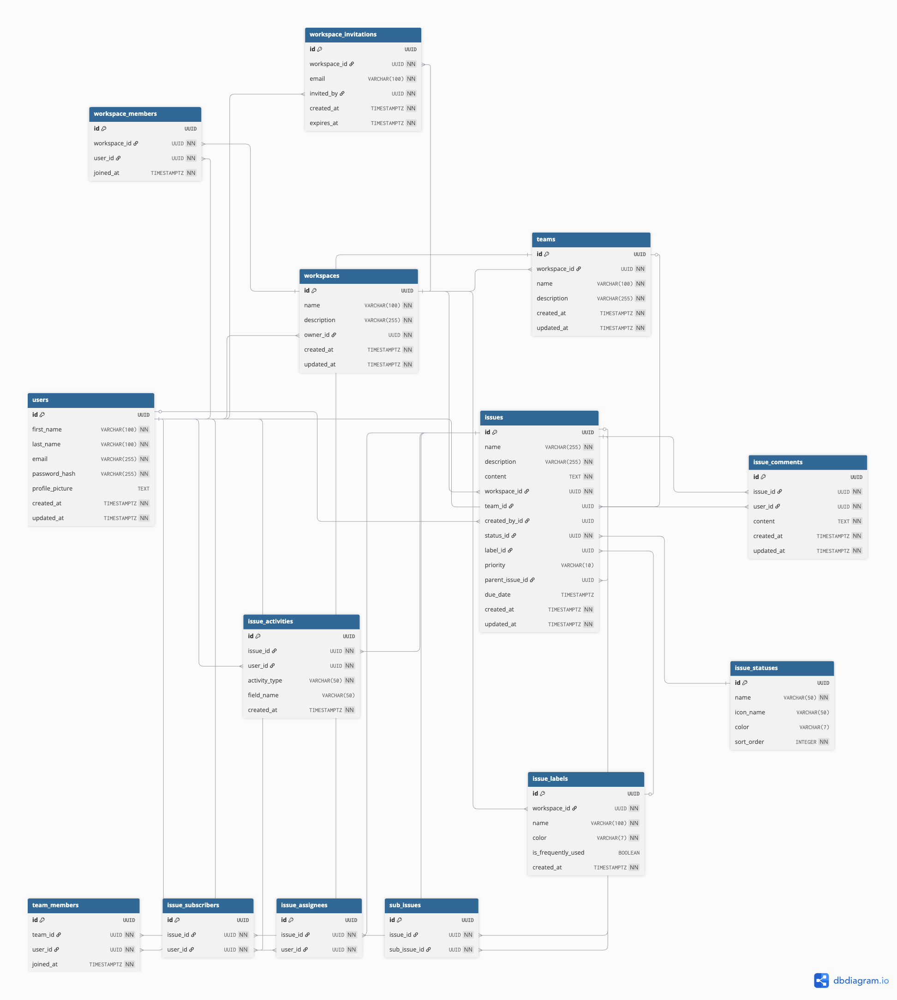

# Server - Project Management Application

A robust Node.js backend API for the project management application, built with TypeScript, Express.js, and PostgreSQL.

## ⚙️ Tech Stack

| Technology     | Purpose                                        |
| -------------- | ---------------------------------------------- |
| **Node.js**    | JavaScript runtime for server-side development |
| **TypeScript** | Type-safe server-side JavaScript               |
| **Express.js** | Fast, minimalist web framework                 |
| **PostgreSQL** | Robust relational database                     |
| **Jest**       | Comprehensive testing framework                |
| **AWS S3**     | Cloud storage for images and file uploads      |
| **Docker**     | Containerization and deployment                |

## 🚀 Quick Start

### Prerequisites

- **Node.js**: v22+ (recommended v22+)
- **PostgreSQL**: v17+
- **Yarn**: Package manager

### Development

```bash
# Navigate to server directory
cd server

# Install dependencies
yarn install

# Set up environment variables
cp .env.example .env
# Edit .env with your configuration

# Initialize database
yarn db:init

# Start development server
yarn dev

# Run tests
yarn test

# Run tests in watch mode
yarn test:watch
```

### Docker Development

```bash
# From project root - start both client and server
yarn docker:up

# View server logs specifically
docker-compose logs server

# Stop services
yarn docker:down
```

## 📁 Project Structure

```
server/
├── src/
│   ├── config/             # Database and app configuration
│   ├── controllers/        # Request handlers
│   ├── db/                 # Database schema and migrations
│   ├── middleware/         # Express middleware
│   ├── repositories/       # Data access layer
│   ├── routes/             # API route definitions
│   ├── schemas/            # Request/response validation schemas
│   ├── services/           # Business logic layer
│   ├── types/              # TypeScript type definitions
│   └── utils/              # Utility functions
├── apis/                   # REST API documentation files
├── screenshots/            # Project documentation images
├── Dockerfile             # Docker configuration
└── package.json           # Dependencies and scripts
```

## 🗃️ Database

### Schema

The application uses PostgreSQL with the following main entities:

- **Users**: User accounts and authentication
- **Workspaces**: Team/organization containers
- **Projects**: Project management within workspaces
- **Teams**: User groups within workspaces
- **Join Requests**: Workspace access management



### Setup

```bash
# Initialize database with schema
yarn db:init

# Reset database (development only)
yarn db:reset
```

## 🔐 Authentication & Authorization

### Authentication Flow

1. Users register/login to get JWT tokens
2. Access tokens for API requests
3. Refresh tokens for token renewal

### Workspace Roles

- **Workspace Owner**: Full permissions, manage join requests
- **User**: Create/view projects, cannot manage workspace or remove users

## 🛠️ API Endpoints

### Authentication

- `POST /api/auth/register` - User registration
- `POST /api/auth/login` - User login
- `POST /api/auth/refresh` - Token refresh

### Users

- `GET /api/users/profile` - Get user profile
- `PUT /api/users/profile` - Update user profile

### Workspaces

- `GET /api/workspaces` - List user workspaces
- `POST /api/workspaces` - Create workspace
- `GET /api/workspaces/:id` - Get workspace details
- `POST /api/workspaces/:id/join-request` - Request to join workspace

See `apis/` directory for detailed REST API documentation.

## 🧪 Testing

```bash
# Run all tests
yarn test

# Run tests in watch mode
yarn test:watch

# Run tests with coverage
yarn test:coverage

# Run specific test file
yarn test auth.test.ts
```

## 🔧 Configuration

### Environment Variables

Create a `.env` file in the server directory:

```env
# Database Configuration
POSTGRES_HOST=localhost
POSTGRES_PORT=5432
POSTGRES_USER=your_username
POSTGRES_PASSWORD=your_password
POSTGRES_DB=project_management

# Server Configuration
PORT=8000
NODE_ENV=development

# JWT Configuration
JWT_SECRET=your_jwt_secret
```

### Development URLs

- **API Server**: http://localhost:8000
- **Database**: localhost:5432

## 🐳 Docker

The server includes Docker configuration:

```dockerfile
# Multi-stage build for optimized production image
FROM node:22-alpine AS builder
# ... build steps

FROM node:22-alpine AS production
# ... production setup
```

## 📦 Deployment

```bash
# Production build
yarn build

# Start production server
yarn start

# Production with PM2
pm2 start dist/index.js --name "project-management-api"
```

## 🔍 Development Tools

### API Testing

Use the REST files in the `apis/` directory with your favorite REST client.

## 🔗 Related

- [Client Documentation](../client/README.md)
- [Main Project README](../README.md)
